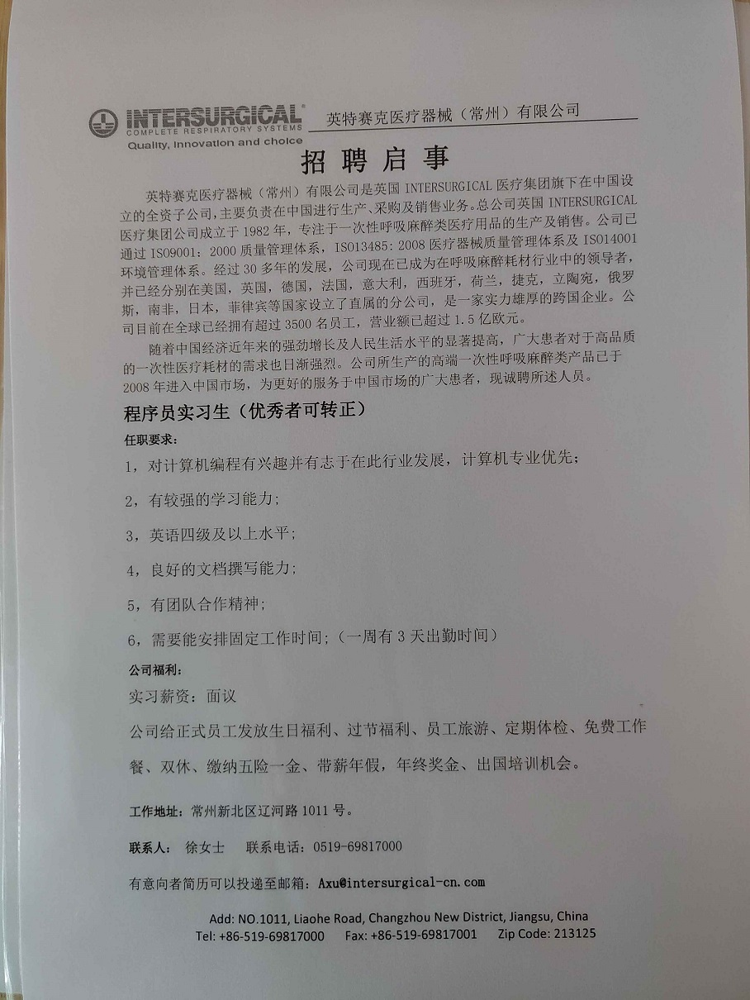

### 前言

*文章写于2019.10.24，因怕文件路径有所冲突，所以只好放在10.23日。*

今天下午5：15，接到来自英特赛克人事部的电话，希望我能填好离职报告，加上门禁卡一起寄回公司。

晚上，我重又拿出拿张门禁卡，珍重地把浮灰擦去。想到即将要把他放进包裹寄走，我心里就五味杂陈，阵阵不舍。这种感觉想来应该就是男生对待初恋女友的那种感觉。

**所以，谨以此文，记录我所进入的第一家公司——英特赛克。**

### 正文

那天应该是今年的3月初，偶然间在班级群里看到一则招实习生的通知。因为此前在CSDN等论坛上看很多大神早早地就找到了实习，我心里有点痒痒，虽然知道自己技术并不成熟，但是依旧是想出去看看公司里的样子。

于是那天中午，我询问了下班导徐强的意见，得到肯定后我立马往通知下方留的电话那打去。

*后来才知道那个时间正是规定午休的时间，实在有些失礼，以后不会再中午12：30给别人打电话了。*

其实当时心里真的特别紧张，生怕晚一些时间职位就没有了。不过还好，对方听了我的自我介绍让我发一份简历到她的邮箱里即可，于是我花了一个下午的时间呆在图书馆把第一份简历做了出来。

平日里懒懒散散的，真一做简历，那种压力、紧张，一下子全出来了。就好比一个身无分文的人，硬是让他自称自己很富裕，这比谦虚难多了。

没有项目经历怎么办？就把课设的项目写上去。只要是或多或少看过的语言，就都自称熟练。

终于，算上自我介绍勉强凑足了两面。傍晚，就把简历发到那个邮箱，开始等消息。

