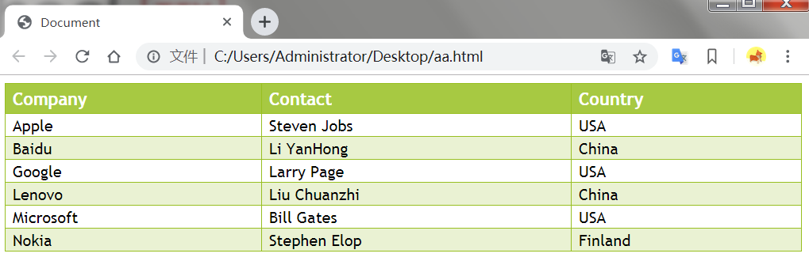

### 一、带着问题学习

**①css盒模型是什么？**

**②display的值有哪几种，这几种值区别是什么？**

**③css怎么实现垂直水平居中？你能使用几种方式实现？**

**④页面的常见布局有那几种，分别可以怎么实现？**

### 二、知识点

#### 1.CSS样式

###### 1.1CSS字体

通过font-family属性选择字体。
```css
body{font-family : sans-serif;}
```

```css
p {
    font-family: Times,'New Century Schoolbook', serif;
}
```
根据这个列表，用户代理会按顺序查找这些字体，如果都不可用，就会简单地选一种serif字体。

*注意：使用了单引号。只有当字体名中有一个或多个空格（比如 New York），或者如果字体名包括 # 或 $ 之类的符号，才需要在 font-family 声明中加引号。*

###### 1.2字体风格
font-style 属性最常用于规定斜体文本，该属性有三个值：
- normal - 文本正常显示
- italic - 文本斜体显示
- oblique - 文本倾斜显示

###### 1.3字体粗细

font-weight属性设置文本粗细。
```css
p{
    font-weight:900;
}
```

###### 1.4大小

font-size属性。

**W3C 推荐使用 em 尺寸单位。**

###### 1.5设置链接的样式

链接的四种状态：

- a:link - 普通的、未被访问的链接
- a:visited - 用户已访问的链接
- a:hover - 鼠标指针位于链接的上方
- a:active - 链接被点击的时刻

**background-color 属性规定链接的背景色**

注意，请按照以下次序规则：

*a:hover 必须位于 a:link 和 a:visited 之后*
*a:active 必须位于 a:hover 之后*


###### 1.6 CSS 列表

使用[list-style-type][1]和[ list-style-image][2]改变列表标志。

也可以将以上列表样式属性合并为一个方便的属性：[list-style][3].

###### 1.7CSS表格
**text-align 属性设置水平对齐方式，比如左对齐、右对齐或者居中**

**vertical-align 属性设置垂直对齐方式，比如顶部对齐、底部对齐或居中对齐**

**如需控制表格中内容与边框的距离，请为 td 和 th 元素设置 padding 属性**

**background-color控制表格背景色。**

***

<center>小demo——好看的表格</center>

**代码**
```html
<!DOCTYPE html>
<html lang="en">

<head>
    <meta charset="UTF-8">
    <meta name="viewport" content="width=device-width, initial-scale=1.0">
    <meta http-equiv="X-UA-Compatible" content="ie=edge">
    <style type="text/css">
        #customers {
            font-family: "Trebuchet MS", Arial, Helvetica, sans-serif;
            width: 100%;
            border-collapse: collapse;
        }

        #customers td,
        #customers th {
            font-size: 1em;
            border: 1px solid #98bf21;
            padding: 3px 7px 2px 7px;
        }

        #customers th {
            font-size: 1.1em;
            text-align: left;
            padding-top: 5px;
            padding-bottom: 4px;
            background-color: #a7c942;
            color: #ffffff;
        }

        .alt {
            color: #000000;
            background-color: #eaf2d3;
        }
    </style>
    <title>Document</title>
</head>

<body>
    <table id="customers">
        <tr>
            <th>Company</th>
            <th>Contact</th>
            <th>Country</th>
        </tr>

        <tr>
            <td>Apple</td>
            <td>Steven Jobs</td>
            <td>USA</td>
        </tr>

        <tr class="alt">
            <td>Baidu</td>
            <td>Li YanHong</td>
            <td>China</td>
        </tr>

        <tr>
            <td>Google</td>
            <td>Larry Page</td>
            <td>USA</td>
        </tr>

        <tr class="alt">
            <td>Lenovo</td>
            <td>Liu Chuanzhi</td>
            <td>China</td>
        </tr>

        <tr>
            <td>Microsoft</td>
            <td>Bill Gates</td>
            <td>USA</td>
        </tr>

        <tr class="alt">
            <td>Nokia</td>
            <td>Stephen Elop</td>
            <td>Finland</td>
        </tr>

    </table>
</body>

</html>
```


[1]:https://www.w3school.com.cn/cssref/pr_list-style-type.asp
[2]:https://www.w3school.com.cn/cssref/pr_list-style-image.asp
[3]:https://www.w3school.com.cn/cssref/pr_list-style-position.asp