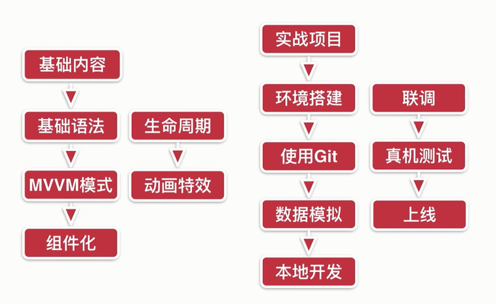
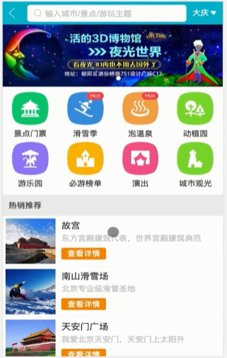
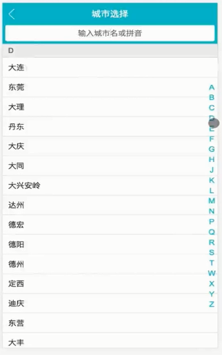

 

- [前言](#%e5%89%8d%e8%a8%80)
- [正文](#%e6%ad%a3%e6%96%87)

## 前言
从今天开始学习课程[《Vue2.5开发去哪儿网App
从零基础入门到实战项目》](https://coding.imooc.com/class/203.html).

<strong>课程流程</strong>

<strong>项目截图</strong>

## 正文

