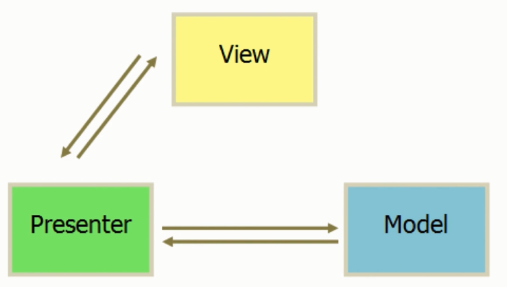

 

- [前言](#%e5%89%8d%e8%a8%80)
- [正文](#%e6%ad%a3%e6%96%87)
  - [MVP 设计模式](#mvp-%e8%ae%be%e8%ae%a1%e6%a8%a1%e5%bc%8f)

## 前言
从今天开始学习课程[《Vue2.5开发去哪儿网App
从零基础入门到实战项目》](https://coding.imooc.com/class/203.html).

<strong>课程流程</strong>

<strong>项目截图</strong>

## 正文

### MVP 设计模式

- M：Model层，数据服务层，负责数据的增删改查。
- V：View层，视图界面层，负责UI的渲染、子视图的组织、UI事件、用户交互等。
- P：Presenter层在View和Model之间起到桥梁的作用，又封装了业务的复杂度,使UI和业务都可以独立的进行变化。 