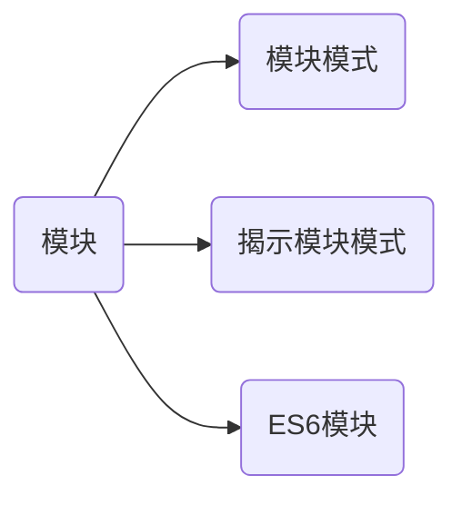

今天在掘金上看了篇文章 [《JavaScript 的 7 种设计模式》](https://juejin.cn/post/6930386249605709832?utm_source=gold_browser_extension)，一些感想写在下面：

- 设计模式可以帮助你写出更好的可读性更高的代码，并且代码更容易被维护和理解。
- 理解了常用的设计模式后，再接手其他项目时可以省下很多时间。

### 模块模式

模块模式大致分为三种：

- 模块模式
- 揭示模块模式
- ES6 模块



代码示例：

① 模块模式

```js
const myModule = (function() {  
  const privateVariable = 'Hello World';  
  function privateMethod() {
    console.log(privateVariable);
  }
  return {
    publicMethod: function() {
      privateMethod();
    }
  }
})();
myModule.publicMethod();	// Prints 'Hello World'
```

② 揭示模块模式

```js
const myRevealingModule = (function() {  
  let privateVar = 'Peter';
  const publicVar  = 'Hello World';
  function privateFunction() {
    console.log('Name: '+ privateVar);
  }
  
  function publicSetName(name) {
    privateVar = name;
  }
  function publicGetName() {
    privateFunction();
  }
  /** reveal methods and variables by assigning them to object     properties */
return {
    setName: publicSetName,
    greeting: publicVar,
    getName: publicGetName
  };
})();
myRevealingModule.setName('Mark');
// prints Name: Mark
myRevealingModule.getName();
```

③ ES6 模块

```js
// utils.js
export const greeting = 'Hello World';
export function sum(num1, num2) {
  console.log('Sum:', num1, num2);
  return num1 + num2;
}
export function subtract(num1, num2) {
  console.log('Subtract:', num1, num2);
  return num1 - num2;
}
// This is a private function
function privateLog() {
  console.log('Private Function');
}

// main.js
// importing multiple items
import { sum } from './utils.js';
console.log(sum(3, 7));
```

### 单例模式：

我自己理解的单例模式的核心是：在创造对象前，对变量是否为空做了个校验，这样就可以确保生成对象的唯一。

```js
const singleton = (function() {
  let instance;
  
  function init() {
    return {
      name: 'Peter',
      age: 24,
    };
  }
  return {
    getInstance: function() {
      if(!instance) {
        instance = init();
      }
      
      return instance;
    }
  }
})();
const instanceA = singleton.getInstance();
const instanceB = singleton.getInstance();
// prints true
console.log(instanceA === instanceB);
```

### 工厂模式：

类似 Java 的类和类的继承，事先定义几个生成具体对象的类（保留一定的自定义属性），再创建一个中转类，去将生成对象的任务派发到对应的类下。

```js
class Car{
  constructor(options) {
    this.doors = options.doors || 4;
    this.state = options.state || 'brand new';
    this.color = options.color || 'white';
  }
}
class Truck {
  constructor(options) {
    this.doors = options.doors || 4;
    this.state = options.state || 'used';
    this.color = options.color || 'black';
  }
}
class VehicleFactory {
  createVehicle(options) {
    if(options.vehicleType === 'car') {
      return new Car(options);
    } else if(options.vehicleType === 'truck') {
      return new Truck(options);
      }
  }
}

const factory = new VehicleFactory();
const car = factory.createVehicle({
  vehicleType: 'car',
  doors: 4,
  color: 'silver',
  state: 'Brand New'
});
const truck= factory.createVehicle({
  vehicleType: 'truck',
  doors: 2,
  color: 'white',
  state: 'used'
});
// Prints Car {doors: 4, state: "Brand New", color: "silver"}
console.log(car);
// Prints Truck {doors: 2, state: "used", color: "white"}
console.log(truck);
```

